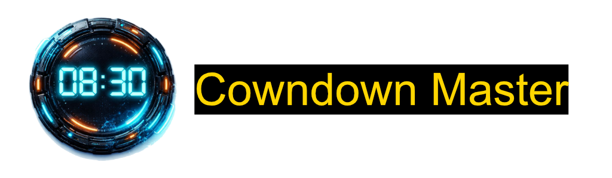
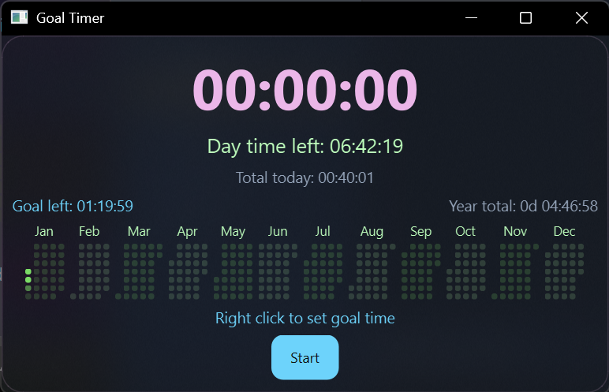
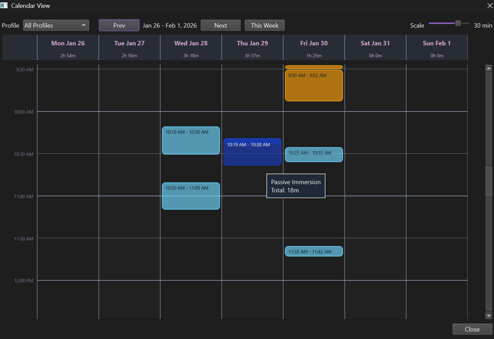
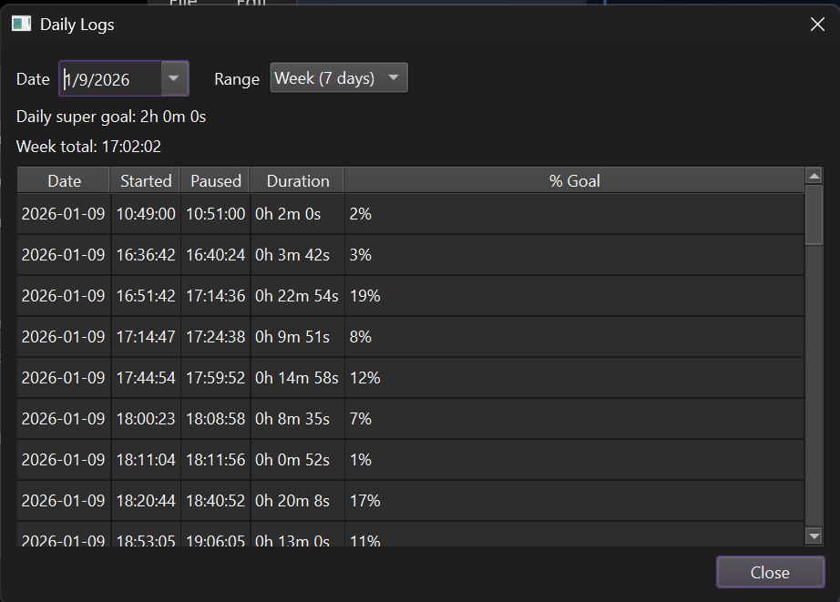
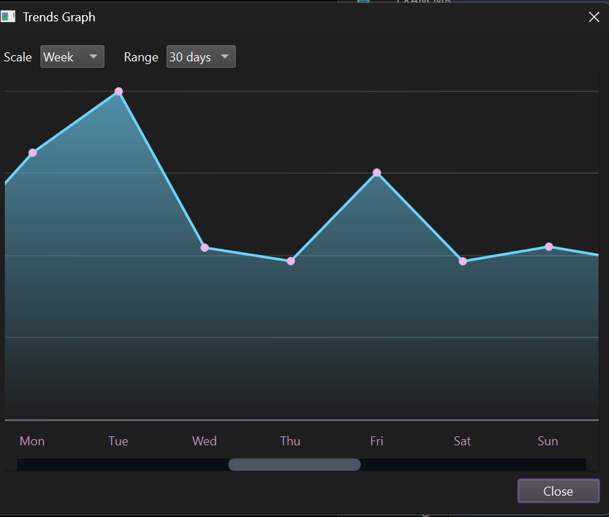

# Countdown Master

Countdown Master is vibe coded small desktop timer that combines a countdown goal timer
with daily goal tracking, a year heatmap, and daily logs. I use it for tracking
my daily immersion, i started using this on day 1 of 2026 and already at 7 hours +
I know 7 hour isn't the highest for 3 days, but this app has me immersing more,
today I upped my super goal time to 3 hours, if i didn't i would only be at 6 hours.
I expect to hit higher numbers now. if you find issues or have features you want, ask or just
clone and work on it yourself, tho it be cool to see what you add. It is built with
PySide6 (Qt) and stores data locally in `data.csv` plus preferences in
`settings.ini`.

## Features

- (Change) Reordered the right click menu
- (NEW) Added Calendar View, shows time blocks
- (New) Profile editor to change color, shown in trends graph
- (New) Hotkey setting in right click to toggle buttons on off with keyboard or gamepad using xinput
- (New) Clock On/off, just click to start tracking, no goal needed adds to your daily tracking
- (New) Hide Menu UI, remove something you don't need so you can make size smaller
- (New) Log, now shows week of tracking for the date selected
- (New) Profiles, these profiles should have all the profiles you need, or add your own
- Countdown timer with a “current goal” duration
- Daily super goal tracking and goal-left indicator
- Year heatmap of logged time, with adjustable cell size and month padding
- Daily log viewer with percent-of-goal summaries
- Customizable colors, fonts, and glow pulse duration
- Always-on-top mode and saved window position/size

## Screenshot





## Requirements

- Python 3.9+ (PySide6 supports 3.8+)
- Windows, macOS, or Linux(will have to virtual machine test Linux) with a desktop environment

Dependencies are listed in `requirements.txt`.

## Install

```bash
python -m venv .venv
```

Activate the venv:

```bash
# Windows (PowerShell)
.venv\Scripts\Activate.ps1

# macOS/Linux (bash/zsh)
source .venv/bin/activate
```

Install dependencies:

```bash
pip install -r requirements.txt
```

## Run
On Ubuntu, i know on Linux mint vm i had to do the following, or else there is an error
```sudo apt update
sudo apt install -y libxcb-cursor0
```

Ai tells me this about Arch Manjaro and pacman based Linux
```sudo pacman -Syu xcb-util-cursor```

Fedora (ai says)
```sudo dnf install -y xcb-util-cursor```


```bash
python main.py
```

On Windows you can also use(re-added, this should work if python is in your path):

```bat
run.bat
```

## Usage

- Right-click the window to open the menu.
- Use “Set Current Goal” to set the countdown duration.
- Use “Set Daily Super Goal” to define your daily target.
- The heatmap shows total time logged per day; scroll over it to change base
  cell size.
- Settings lets you customize colors, fonts, glow duration, and heatmap layout.


## Data Files

- `active.csv`: Active profile, session history and daily totals
- `settings.ini`: UI preferences, goals, and window geometry
